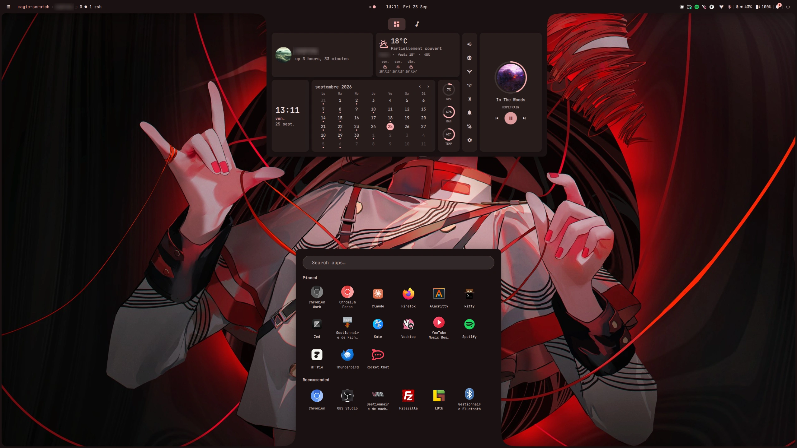

# scottbass3-shell

A Material You desktop shell for **Hyprland**, built with
[Quickshell](https://quickshell.outfoxxed.me). It has a top bar, an app
launcher styled after the Windows 11 start menu, a notification center, media
controls, a tools toolbar, a lock screen and a settings app with a theme
designer. Everything is written in QML, and the panels use SDF corners that
merge into a rounded screen frame.



> ⚠️ **Requires the Hyprland Lua config.** The integration uses the `hl.*` Lua
> API (special workspace toggles, focus dispatch, window moves). With the
> classic hyprlang (`.conf`) config, you'll have to port `hypr/quickshell.lua`
> and `scripts/hypr/*.sh` yourself.

## Features

- **Top bar**: per-monitor workspaces with live window thumbnails on hover,
  clock, window title, system tray, notifications, power, and an optional
  status group (network, Bluetooth, microphone, audio, battery).
- **App launcher**: type anywhere to search, arrow-key navigation across the
  grid, pinned apps you can reorder by dragging, recommendations ranked by
  frequency and recency, and right-click menus. It opens from the bottom of the
  screen.
- **Notification center**: popups and a history panel. Clicking a notification
  focuses or launches its app, and reveals its special workspace if the app is
  parked in one. Includes a do-not-disturb toggle.
- **Dashboard**: profile, weather, calendar (with khal events), system stats,
  quick settings (volume, brightness, Wi-Fi, VPN, Bluetooth), media controls
  and an audio visualizer. Media covers MPRIS players plus a realtime YouTube
  Music companion, and pauses one player when another starts.
- **System tray**: hide items per app, left-click to toggle an app's special
  workspace, choose per app whether it launches straight into that workspace,
  and pin apps that have no tray icon (run a command or toggle a workspace).
- **Tools toolbar**: an optional dock on the right edge with your own buttons
  (name, command, icon picked from a list). A wallpaper and theme picker is
  built in.
- **Lock screen**: a session lock that survives a shell hot reload.
- **Settings app**, all changes applied live:
  - **Appearance**: frame, top bar only or floating islands.
  - **Themes**: built-in Material You themes, plus creating, duplicating,
    renaming, deleting, importing and exporting your own. Themes can also be
    generated from the wallpaper with `matugen`.
  - **Wallpaper**: local images, favorites, a [Wallhaven](https://wallhaven.cc)
    browser (search, sort, download) and a timed rotation that re-themes on
    each change.
  - **Keybindings**: Hyprland shortcuts for the shell's actions. None are bound
    by default.
  - **Hyprland**: drag monitors around a visual layout (with edge snapping),
    set resolution, scale and rotation, and tune gaps, borders, rounding, blur,
    shadows and input. Only the values you change are written, to a generated
    Lua file loaded after your own config, which is never modified. Display
    changes revert after a countdown unless you confirm them.
  - Bar widgets, tray, tools, weather and a list of optional dependencies.
- **Per-monitor workspaces**: each screen gets its own workspaces 1 to 10,
  with Super+N to switch and Super+Shift+N to move the active window.

## Requirements

| | |
|---|---|
| **Compositor** | Hyprland 0.55+ with the **Lua** config |
| **Shell** | [`quickshell`](https://quickshell.outfoxxed.me) 0.3 or git |
| **Build** | `git`, `cmake`, `make`, a C++20 compiler, **Qt 6.8+** (Core, Qml, Quick, ShaderTools) |

### Optional runtime dependencies

The shell runs without these. Each one enables a feature, and Settings →
Dependencies shows which are missing.

| Tool | Enables |
|---|---|
| `hyprpaper` + `matugen` | Wallpaper switching and Material You themes from the wallpaper |
| `magick` (imagemagick) | Light or dark theme picked from the wallpaper's brightness (dark otherwise) |
| `cava` | Audio visualizer |
| `brightnessctl` | Brightness control |
| `secret-tool` (libsecret) | Keyring storage for tokens (YouTube Music) |
| `qt6-websockets` (Qt module) | Realtime YouTube Music companion |
| `khal` (+ `vdirsyncer`) | Calendar events (+ creating and syncing them) |
| `nmcli` (networkmanager) | VPN section of the network panel |
| `wpctl` (wireplumber) | Bluetooth audio profile switching (A2DP or headset) |
| `curl` | Downloads from the Wallhaven browser |

Wi-Fi (scan, connect with a password, forget, radio toggle), Bluetooth (scan,
pair, connect, trust, forget, rename, battery) and battery alerts are handled
in the shell through Quickshell's NetworkManager, BlueZ and UPower bindings, so
nm-connection-editor and blueman aren't needed. For static IPs, 802.1X or VPN
editing, use a NetworkManager front-end.

Media uses Quickshell's MPRIS support, so `playerctl` isn't needed. The YouTube
Music companion talks to the ytmdesktop server over a WebSocket and doesn't
need Node.

Screenshots, clipboard and idle locking are left to Hyprland: add your own
binds in `hyprland.lua` (e.g. `grim`, `slurp`, `wl-copy`) and an idle daemon,
e.g. `hypridle` running `scottbass3-shell ipc call lock lock` (or
`~/.config/quickshell/launch.sh ipc call lock lock` from a git checkout).

## Install

**AUR** (Arch Linux), installed to `/etc/xdg/quickshell/scottbass3-shell`:

```sh
yay -S scottbass3-shell-git
```

**Nix** (flake), add the input and install the package:

```nix
inputs.scottbass3-shell.url = "github:scottbass3/shell";
# …
environment.systemPackages = [ inputs.scottbass3-shell.packages.${pkgs.stdenv.hostPlatform.system}.default ];
```

The package bundles `quickshell` and the lightweight optional tools (hyprpaper,
matugen, imagemagick, cava, brightnessctl, curl, libsecret). The shell itself
is in the package's `share/scottbass3-shell`.

**Git checkout**, with the install script (clones to `~/.config/quickshell` and
builds the plugin):

```sh
curl -fsSL https://raw.githubusercontent.com/scottbass3/shell/main/install.sh | bash
```

or by hand:

```sh
git clone https://github.com/scottbass3/shell ~/.config/quickshell
cd ~/.config/quickshell
./install.sh
```

`install.sh` builds the bundled `Caelestia.Blobs` Qt plugin into
`./Caelestia/Blobs`, lists which optional tools are installed and prints the
Hyprland steps.

## Hyprland integration

Add this at the **end** of your `hyprland.lua`. For the AUR package:

```lua
loadfile("/etc/xdg/quickshell/scottbass3-shell/hypr/quickshell.lua")()
```

For Nix, with the package's store path (e.g. interpolated from home-manager):

```lua
loadfile("${scottbass3-shell}/share/scottbass3-shell/hypr/quickshell.lua")()
```

For a git checkout:

```lua
loadfile(os.getenv("HOME") .. "/.config/quickshell/hypr/quickshell.lua")()
```

This sets `misc.allow_session_lock_restore`, starts the shell, binds the
per-monitor workspaces (`SUPER + 1..0`, add Shift to move the window) and loads
the files generated by Settings (keybindings and Hyprland overrides). They're
loaded last, so they apply on top of your config without changing it.

The shell's shortcuts (launcher, settings, lock, tools, scratchpad) are
**not bound by default**. Set them in **Settings → Keybindings**: they're
written to `~/.local/state/scottbass3-shell/binds.generated.lua` and applied
with `hyprctl reload`. Until then, open the launcher from the bar button and
Settings from the gear icon in the dashboard.

Apps that should open directly in a special workspace are set in Settings →
Tray → *Launch in special workspace*, which writes window rules you can switch
on and off.

From a git checkout you can edit `hypr/quickshell.lua` directly. The AUR and
Nix copies are replaced on every update, so copy the file somewhere else and
`loadfile` your copy instead.

## Running manually

```sh
scottbass3-shell &                 # AUR or Nix package
~/.config/quickshell/launch.sh &   # git checkout
```

`launch.sh` (the `scottbass3-shell` command in the packages) adds the plugin to
`QML_IMPORT_PATH` and runs `quickshell` on its own config directory. Extra
arguments go to `quickshell`, e.g. `scottbass3-shell ipc call settings toggle`.

## Configuration

Everything is configured in the settings app: appearance, themes, wallpaper,
bar widgets, tray, tools, weather, keybindings and Hyprland.

Settings, custom themes, pinned apps, app usage and generated files are stored
in `~/.local/state/scottbass3-shell` (or `$XDG_STATE_HOME/scottbass3-shell`),
never in the shell's directory, so updates don't touch your configuration.
State from older versions in `~/.local/state/quickshell` is moved there
automatically.

## License

[GPLv3](LICENSE). The `Caelestia.Blobs` plugin in `blobs-plugin/` is derived
from the [Caelestia](https://github.com/caelestia-dots) project.
